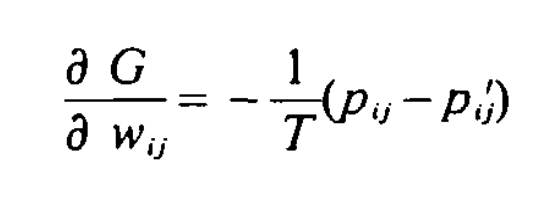

Boltzmann machines are fundamentally collections of probabilistic units that can be on or off (binary). The probability of any given configuration of units is equal to the "energy" of that configuration relative to the energy of all possible configurations. This is a way of connecting statistical physics with deep learning: by treating energy as the loss function of the learning task assigned to a Boltzmann Machine, given that the laws of physics state that the energy will eventually approach a minimum configuration (similarly to in protein folding), this gives us a unique way to optimize a neural network.  
According to Hinton in his formulation of RBMs (restricted boltzmann machines), the stochasticity of the network allows a given unit to occasionally turn on, even when the total input to the unit is negative. This random activity allows it to jump over "energy barriers", thus escaping local minima. 
  Simulated annealing, when applied to BMs, is an effective way to induce this type of random jumping. This technique involves making the weights and energies of a system scaled by the factor of the system's temperature (similar to in transformer models today), which can then be progressively decreased from high to low as the training procedure runs. When the temperature of the system is 0, then the RBM is fundamentally a Hopfield net. 
  For a BM learning task, the goal is to find a set of weights and biases that closely approximates the state vectors to a Boltzmann distribution with high probability assigned to the training vectors. Thus, we are learning the distribution of the training vectors.  

 
Updates following gradient descent for BMs involve subtracting this gradient formula scaled by a learning rate from wij. This is extremely powerful, because it doesn't involve knowledge about all of the error derivatives in the network, such as with the backpropagation algorithm.  
What makes a Restricted Boltzmann Machine restricted? Well, there is a set condition that no connections can exist between two hidden units or two visible units. So the hidden units are independent from each other if we are given a visible unit vector, and vice versa.  

Things that made this topic easier to understand: 
- Boltzmann machines are recurrent neural networks. They don't flow necessarily straight from visible units to hidden units, and that's why each weight is symmetric and has the same value in either direction.  
- The network assigns an energy to each configuration of nodes. This energy is the loss function of the network.  
- According to the original paper of the learning algorithm for BMs, the state of a unit in the model represents whether or not the universe accepts a hypothesis about the domain. The weight between two units represents if the two hypotheses tend to be accepted together or not.  
- In order to make the network function like an input->output neural network, you can "clamp" some of the visible units, thus allowing them to function as input units. "the system will then find the minimum energy configuration that is compatible with that input", because the network is cyclical.  
-  "The energy of a configuration can be interpreted as the extent to which that combination of hypotheses violates the constraints implicit in the problem domain, so in minimizing energy the system evolves towards “interpretations” of that input that increasingly satisfy the constraints of the problem domain." (Ackley, Hinton, and Sejnowski)  
- Basically, the algorithm for learning in a BM is switching each "hypothesis" into whichever state gives it a lower energy configuration given the states of all other hypotheses.  
- In order to avoid local minima by introducing noise to the model, we use a Metropolis Sampling Algorithm, which sets any given unit to On with probability equal to the sigmoid of the change in Energy (for switching states) over the temperature of the system, which is the same as a particle with two energy states. When we think of a global aggregation of these units, we will approximate the Boltzmann distribution over time.  
- The fundamental idea behind Boltzmann machines: "The units of a Boltzmann Machine partition into two functional groups, a nonempty set of visible units and a possibly empty set of hidden units. The visible units are the interface between the network and the environment; during training all the visible units are clamped into specific states by the environment; when testing for completion ability, any subset of the visible units may be clamped. The hidden units, if any, are never clamped by the environment and can be used to “explain” underlying constraints in the ensemble of input vectors that cannot be represented by pairwise constraints among the visible units." Thus, the hidden units are able to learn the connections between the input vectors and model the environment, while the visible units are the closest things to input neurons in this network.   
- In theory, it is impossible to achieve a perfect model of the environment, because it would require too many hidden units. Also, there is no modeling of sequential relationships between input data, so you can't use a BM for time-series data. 
- The learning algorithm uses the G metric for gradient descent to measure the difference between the environment distribution and the distribution of the model running freely.   
- Changes to weights only require locally available behavior! We can see this when we take the gradient of our G metric, which simplifies to the following:   
The terms in this gradient are only the probability of two units both being on, when environmentally clamped vs. when the network is running freely. However, both of these terms are estimates, and thus the length that we estimate them over is an important hyperparameter. 
- An interesting application of Boltzmann machines is the "Encoder problem", which I think is the same as an autoencoder. Basically, two separate sets of visible units are not connected to each other, but are each connected to a hidden unit layer which is of smaller size than both visible layers. Thus, it functions as a bottleneck through which information must learn to be passed. We clamp both sets of visible vectors and allow the hidden layer in the middle to reach an equilibrium, tracking how many times corresponding units across visible layers are on together. 